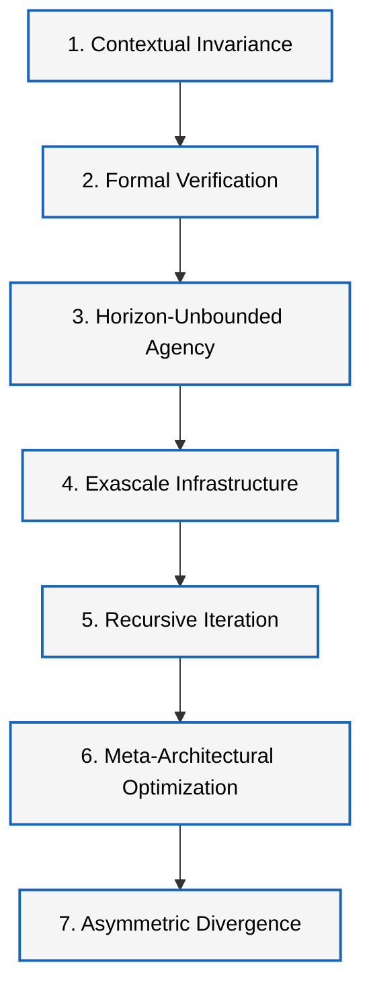

# Forecasting AGI and ASI Arrival: A Stage-Gated Monte Carlo Model

## Abstract

This research note describes a public Monte Carlo model that forecasts AGI first and then models the uncertain transition from AGI to capability-and-agency ASI. The model separates evidence about AGI, intermediate milestones, AI R&D automation, takeoff, governance, and public deployment.

## Why AGI And ASI Must Be Separated

Most empirical evidence is not direct ASI evidence. It usually concerns coding benchmarks, agent task horizons, compute growth, AGI forecasts, transformative AI forecasts, or AI R&D automation proxies. Treating those as direct ASI evidence would compress the model too much and overstate what the sources support.

The model therefore uses:

```text
AGI forecast -> AGI-to-ASI transition -> internal ASI -> public ASI
```

## Definitions

AGI means broad human-level or expert-level general cognitive capability across economically valuable tasks.

Capability-and-agency ASI means substantially beyond top human teams across the most important cognitive domains, with long-horizon agency and especially superhuman AI R&D capability.

## Refined 7-Checkpoint Capability Ladder

The model uses a 7-checkpoint capability ladder as a qualitative screen for
new evidence. The ladder is not a fourth forecast target. It helps classify
whether a new result should primarily update AGI timing, the AGI-to-ASI lag,
AI R&D automation, infrastructure friction, recursive-progress assumptions, or
the internal ASI threshold.



| Checkpoint | Refined metric | Main model implication |
|---|---|---|
| Contextual Invariance | Lossless semantic retrieval across a continuous 10^8-token context with less than 0.01% needle-in-a-haystack decay. | Updates long-horizon reliability and AGI integration assumptions. |
| Autonomous Formal Verification | Closed-loop proof generation for an unverified conjecture or non-trivial software kernel in a verified proof assistant, with zero human prompting. | Updates general capability, AI R&D automation, and superhuman AI researcher lags. |
| Horizon-Unbounded Agency | A 336-hour production run across cross-domain engineering objectives with dynamic self-correction and 0% fatal exceptions. | Updates agent task horizon and autonomous engineering thresholds. |
| Exascale Infrastructure Hardening | Orchestration of a distributed optical cluster drawing >=1.2 GW, with >99.99% utilization and 30-day fault-tolerant checkpointing. | Updates compute growth, infrastructure friction, and governance constraints. |
| Recursive Synthetic Iteration | Five generations of monotonic gains from fully synthetic data loops without model collapse. | Updates takeoff lag and algorithmic efficiency assumptions. |
| Meta-Architectural Optimization | Automated validation of a new architecture or training paradigm that reduces FLOPs by >=10% against state-of-the-art baselines. | Updates algorithmic efficiency and superhuman AI researcher assumptions. |
| Asymmetric Takeoff Divergence | Cross-domain capability accumulation faster than 100x the cumulative human engineering baseline per hour. | Updates takeoff dynamics and the internal ASI threshold. |

## Evidence Classification

Evidence is split into:

- AGI evidence: AGI, TAI, weak AGI, general AI, or human-level AI claims.
- ASI evidence: superintelligence, recursive self-improvement, superhuman AI researcher, or intelligence explosion claims.
- Intermediate milestones: coding automation, agent task horizon, compute growth, algorithmic efficiency, AI R&D automation, deployment delay, and governance delay.

## Model Architecture

For each simulated future:

1. Sample AGI-stage inputs.
2. Estimate coding automation month.
3. Estimate long-horizon agent reliability month.
4. Estimate broad general capability month.
5. Set AGI as the maximum of those AGI prerequisites plus integration lag.
6. Add AGI-to-ASI transition lags: AI R&D automation, superhuman AI researcher, takeoff, infrastructure, and governance.
7. Estimate internal ASI.
8. Add public deployment delay.
9. Estimate public ASI.

## AGI Forecast

AGI is driven by coding automation, long-horizon agent reliability, broad capability lag, compute growth, and algorithmic efficiency.

## AGI-to-ASI Transition

The AGI-to-ASI transition is modeled as a lag from AGI through AI R&D automation, superhuman AI researcher capability, accelerated or recursive progress, infrastructure friction, and governance delay.

## Internal ASI Forecast

Internal ASI is the first month capability-and-agency ASI exists inside a lab, company, government, or restricted deployment.

## Public ASI Forecast

Public ASI is internal ASI plus public deployment delay. It may lag internal ASI because of red-teaming, policy, secrecy, safety evaluations, or national-security restrictions.

## Sensitivity Analysis

The model reports Spearman rank correlations for:

- AGI arrival
- Internal ASI arrival
- Public ASI arrival
- AGI-to-ASI lag

This is a driver screen, not causal proof.

## Limitations

- Month-level outputs are visualization precision, not certainty.
- Week-level forecasts are rejected as false precision.
- The model is manually specified and should be updated as evidence changes.
- AGI evidence does not directly prove ASI timing.
- The AGI-to-ASI transition remains highly uncertain.

## Update Policy

Updates should preserve old input files for release comparisons, add dated source notes for changed assumptions, rerun tests, and disclose how medians and intervals moved.
